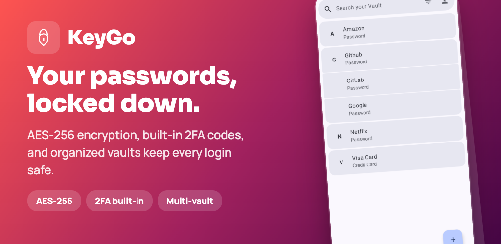
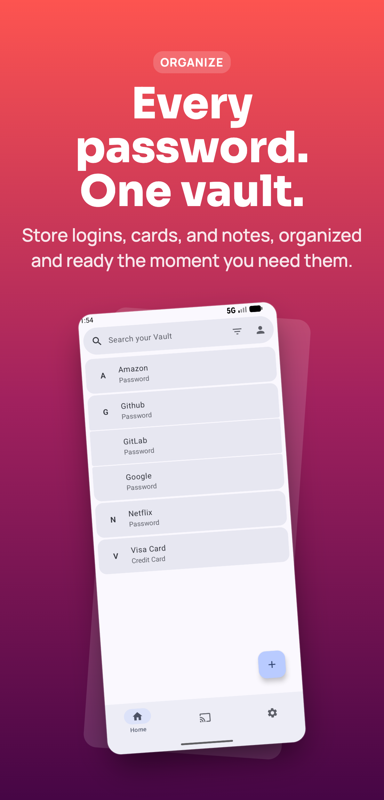
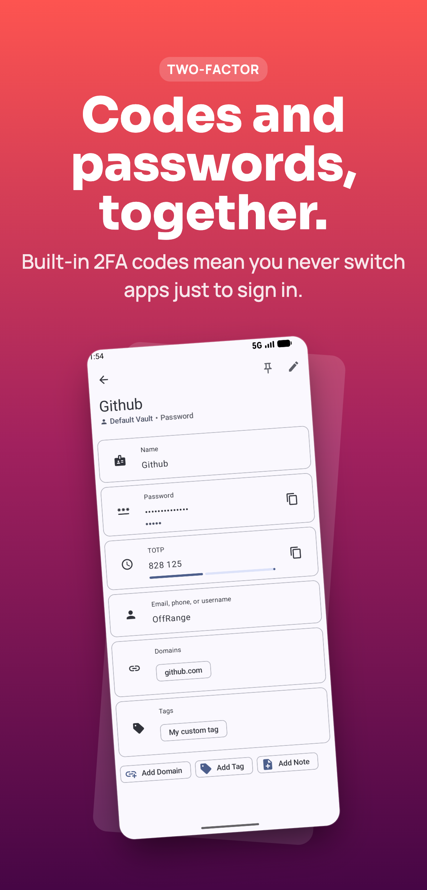
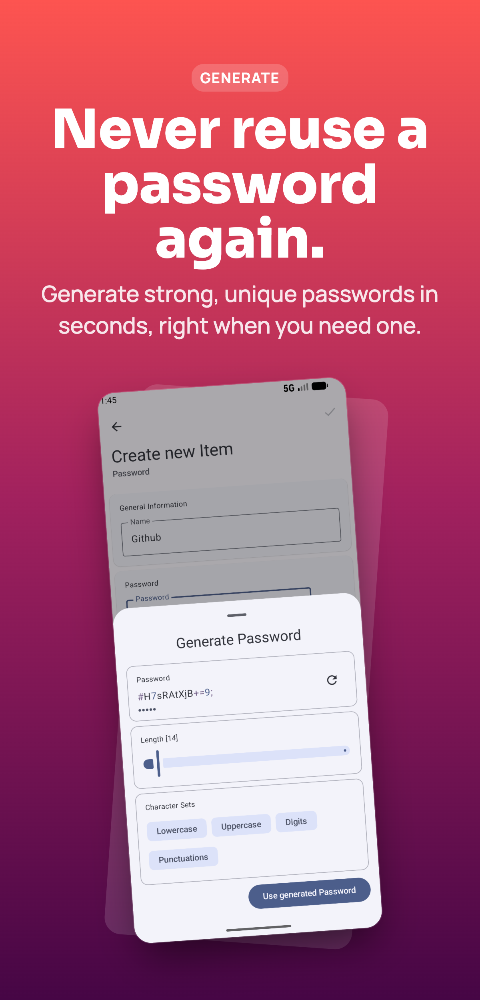

# KeyGo - Your Secure Digital Vault

[](https://github.com/OffRange/KeyGo/releases/)
[](LICENSE)

KeyGo is a secure, open-source Android password manager that allows you to store passwords,
passkeys, and credit card information encrypted entirely on your local device.



### Driven by a modern & intuitive design

<div align="center">
    
    
    
</div>

## Features

* **100% Free & Open Source:** All features are available for free.
* **Local-Only Storage:** Your data will never leave your device.
* **Comprehensive Management:** Store passwords, passkeys, and credit cards.
* **MFA Support:** Built-in authenticator for TOTP tokens.
* **Advanced Security:** Per-item, industry-standard encryption.
* **Seamless Integration:** System-wide autofill service for all your credentials.

## Download

Get the latest version of KeyGo directly from the Play Store or GitHub:
|Platform|Status|
|:------:|:----:|
| Google Play
Store | [](https://play.google.com/store/apps/details?id=de.davis.passwordmanager) |
|GitHub. | [](https://github.com/OffRange/KeyGo/releases/)|

## Build it Yourself

### Prerequisites

You will need to install **Rust**. Rust is used for cryptographic functions and other amazing
features, like generating backups.

If you are using Linux or macOS, simply run this in your terminal:

```bash
curl --proto '=https' --tlsv1.2 -sSf https://sh.rustup.rs | sh
```

*(For Windows, download the installer from the [official Rust website](https://rustup.rs/).)*

### Generate the APK

Once you have Rust installed, you are ready to build the application by running the following
command in the project root:

```bash
./gradlew assembleFdroidRelease
```

Your compiled APK will be generated in `app/build/outputs/apk/`.

### Install on your Device

1. Connect your phone to your computer using a USB cable.
2. [Enable USB debugging on your device](https://developer.android.com/studio/debug/dev-options#Enable-debugging).
3. Install the APK using ADB by running:

```bash
adb install <path-to-apk-file>
```

## License

Licensed under the **GNU General Public License v3.0**. This means KeyGo is free software: you can
redistribute and/or modify it under GPLv3 terms. For full details, see
the [LICENSE](https://www.google.com/search?q=LICENSE) file.
